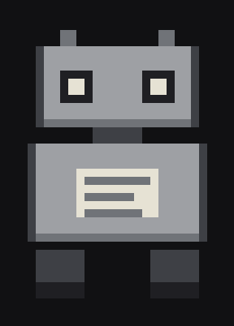

<br/>

<p align="center">
  <a href="https://www.linkedin.com/in/harini-srinivasan-uw" target="_blank">
    
  </a>&nbsp;&nbsp;
  <a href="https://harini.bio" target="_blank">
    
  </a>&nbsp;&nbsp;
  <a href="https://harini-uw.github.io/harini.lol/" target="_blank">
    
  </a>
</p>

<br/>

<p align="center"></p>

<br/>

```
/whoami      mechatronics @ waterloo · 2025–2030
/focus       embedded systems · autonomous robotics · agentic AI · ml pipelines
```

<br/>

### stack

<p align="center">
  &nbsp;
  &nbsp;
  &nbsp;
  &nbsp;
  &nbsp;
  
</p>
<p align="center">
  &nbsp;
  &nbsp;
  &nbsp;
  &nbsp;
  
</p>

<br/>

### things i've built

<table>
  <tr>
    <td width="50%" valign="top">
      <h4><a href="https://harini.bio">harini.bio</a></h4>
      <p>RAG-powered terminal portfolio with a WALL-E sidekick. Ask it anything — it answers from my actual project history.</p>
      <p>
        
        
        
      </p>
    </td>
    <td width="50%" valign="top">
      <h4><a href="https://github.com/Harini-UW/Mind-Mirror">Mind Mirror</a>&nbsp;<a href="https://mindmirror-blush.vercel.app/">↗</a></h4>
      <p>AI brainstorming agent that asks sharper questions instead of giving answers. 1st place @ Calgary Hacks 2026 — 400 participants.</p>
      <p>
        
        
        
      </p>
    </td>
  </tr>
</table>

<br/>


